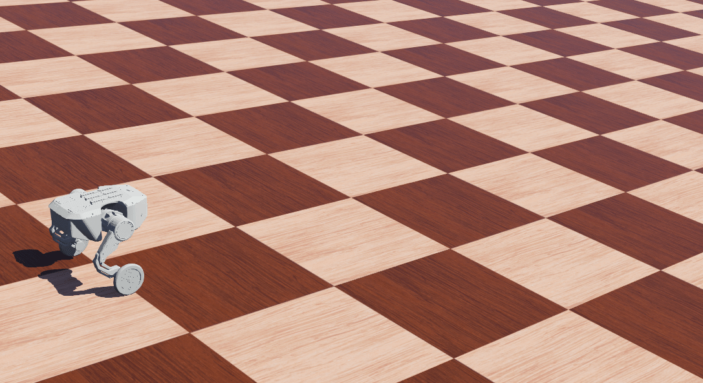
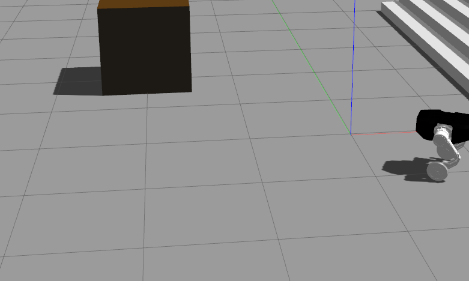

# DDT Robot Lab

[](https://docs.omniverse.nvidia.com/isaacsim/latest/overview.html)[](https://docs.isaacsim.omniverse.nvidia.com/latest/index.html)[](https://docs.python.org/3/whatsnew/3.11.html)[](https://isaac-sim.github.io/IsaacLab)[](https://opensource.org/license/apache-2-0)

## Overview

This project is a reinforcement learning repository developed for **Direct Drive Technology Robotics**, built upon NVIDIA **[IsaacLab](https://github.com/isaac-sim/IsaacLab)**. It currently supports the **[Tita Robot](https://tita-development-manual-uc.readthedocs.io/)** and is compatible with **Isaac Sim 5.0 (recommended)** and Isaac Sim 4.5.

<div align="center">

| <div align="center"> Isaac Lab </div> | <div align="center">  Webots </div> |  <div align="center"> Gazebo</div> |
|--- | --- | --- |
| [](isaaclab.gif) | [](webots.gif) | [](gazebo.gif) |

</div>

## Installation

### Install Isaac Lab

1. **Official Installation**

   Please follow the official NVIDIA Isaac Lab installation guide to set up the environment and dependencies: **[Quick Installation Guide](https://isaac-sim.github.io/IsaacLab/main/source/setup/quickstart.html)**

2. **Community One-Click Script (Optional)**

   Alternatively, you may use a community-contributed one-click installation script for faster setup and simplified dependency configuration:[**One-click installation script**](https://docs.robotsfan.com/isaaclab/source/setup/oneclick_installation.html)

### Install DDT Robot Lab

1. **Clone the repository**

   ```bash
   git clone https://github.com/cmjang/ddtrobot_lab.git
   ```

2. **Directory requirement**

   Do **NOT** place `ddtrobot_lab` in the same directory as `Isaac Lab`.

   Example structure:

   ```bash
   ├── IsaacLab/
   └── ddtrobot_lab/
   ```

3. **Install ddtrobot lab**

   Enter the environment where **Isaac Lab 2.2** is installed.

   ```bash
   cd ddtrobot_lab
   conda activate env_isaaclab
   python -m pip install -e source/ddtrobot_lab
   ```

## Train & Play

1. **Tita**

   ```bash
   # Train Rough
   python scripts/rsl_rl/train.py --task=DDTRobotLab-Velocity-Rough-Tita-v0 --headless
   
   # Play Rough
   python scripts/rsl_rl/play.py --task=DDTRobotLab-Velocity-Rough-Tita-v0
   
   # Train Flat
   python scripts/rsl_rl/train.py --task=DDTRobotLab-Velocity-Flat-Tita-v0 --headless
   
   # Play Flat
   python scripts/rsl_rl/play.py --task=DDTRobotLab-Velocity-Flat-Tita-v0
   ```

2. **Tita use LSTM**

   ```bash
   # Train Rough
   python scripts/rsl_rl/train.py --task=DDTRobotLab-Velocity-Rough-Tita-LSTM-v0 --headless
   
   # Play Rough
   python scripts/rsl_rl/play.py --task=DDTRobotLab-Velocity-Rough-Tita-LSTM-v0
   
   # Train Flat
   python scripts/rsl_rl/train.py --task=DDTRobotLab-Velocity-Flat-Tita-LSTM-v0 --headless
   
   # Play Flat
   python scripts/rsl_rl/play.py --task=DDTRobotLab-Velocity-Flat-Tita-LSTM-v0
   ```

3. **Tensorboard**

   inspect with TensorBoard:

   ```bash
   tensorboard --logdir=logs
   ```

> [!NOTE]
> If you want to control a **SINGLE ROBOT** with the keyboard during playback, add `--keyboard` at the end of the play script.
>
> ```
> Key bindings:
> ====================== ========================= ========================
> Command                Key (+ve axis)            Key (-ve axis)
> ====================== ========================= ========================
> Move along x-axis      Numpad 8 / Arrow Up       Numpad 2 / Arrow Down
> Move along y-axis      Numpad 4 / Arrow Right    Numpad 6 / Arrow Left
> Rotate along z-axis    Numpad 7 / Z              Numpad 9 / X
> ====================== ========================= ========================
> ```

* You can change `Rough` to `Flat` in the above configs.
* Record video of a trained agent (requires installing `ffmpeg`), add `--video --video_length 200`
* Play/Train with 32 environments, add `--num_envs 32`
* Play on specific folder or checkpoint, add `--load_run run_folder_name --checkpoint /PATH/TO/model.pt`
* Resume training from folder or checkpoint, add `--resume --load_run run_folder_name --checkpoint /PATH/TO/model.pt`

**More information you can visit [robot lab](https://github.com/fan-ziqi/robot_lab/)** 

## Troubleshooting

If the **Isaac Sim** interface becomes **unresponsive**, please wait patiently, as this is mainly due to unstable network conditions.You can use some **tools** to improve the network environment, while also setting up a proxy for the terminal.Like:

```bash
export https_proxy=http://127.0.0.1:7890;
export http_proxy=http://127.0.0.1:7890;
export all_proxy=socks5://127.0.0.1:7890
```

## Acknowlegments

This project is built with reference to related open-source projects. Special thanks to:

- [IsaacLab](https://github.com/isaac-sim/IsaacLab) :a GPU-accelerated, open-source framework designed to unify and simplify robotics research workflows
- [webots](https://github.com/cyberbotics/webots) :open-source robot simulator
- [robot_lab](https://github.com/fan-ziqi/robot_lab) :a RL extension library for robots
- [rl sar](https://github.com/fan-ziqi/rl_sar/) :a framework for simulation verification and physical deployment 

